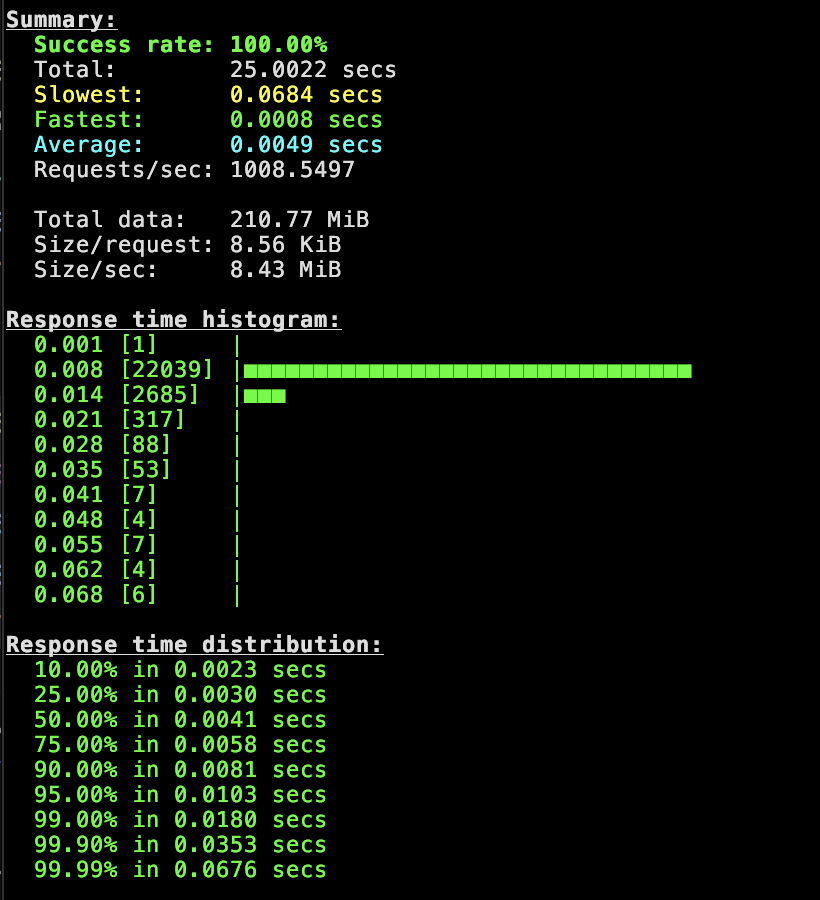

### Http
Over http, we were able to achive P99 of `18ms` with `1K QPS` on just `1vCPU` of for API and `0.5 vCPU` for `Redis` 
```bash
oha -z 25s -c 5 --rand-regex-url "http://localhost:8085/cities/random\\?num=[1-9]{1,4}" 
```
