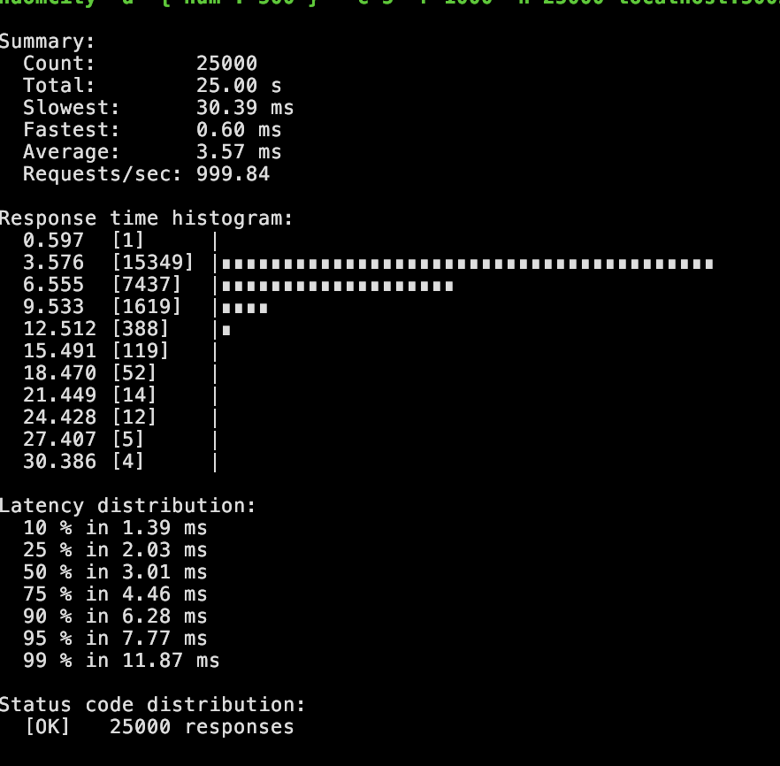

### Http
Over http, we were able to achive P99 of `18ms` with `1K QPS` on just `1vCPU` of for API and `0.5 vCPU` for `Redis` 
```bash
# http
oha -z 25s -c 5 --rand-regex-url \
"http://localhost:8085/cities/random\\?num=[1-9]{1,4}"

# grpc
ghz --insecure --proto src/worldpop/pb/random_city.proto --call randomcity.RandomCityService.GetRandomCity -d '{"num": 500 }' -c 5 -r 1000 -n 25000 localhost:51 
```

| Commit  | Http                      | Grpc                      |
|---------|---------------------------|---------------------------|
| 8ff45db |     |     |

----- 
### Round 1. 

| Percentile       | gRPC (ms) | HTTP (FastAPI) (ms) | Difference (ms) |
|------------------|-----------|---------------------|-----------------|
| 10th             | 1.39      | 3.3                 | -1.91           |
| 25th             | 2.03      | 4.1                 | -2.07           |
| 50th (Median)    | 3.01      | 5.2                 | -2.19           |
| 75th             | 4.46      | 7.0                 | -2.54           |
| 90th             | 6.28      | 9.1                 | -2.82           |
| 95th             | 7.77      | 11.3                | -3.53           |
| 99th             | 11.87     | 19.1                | -7.23           |
-------